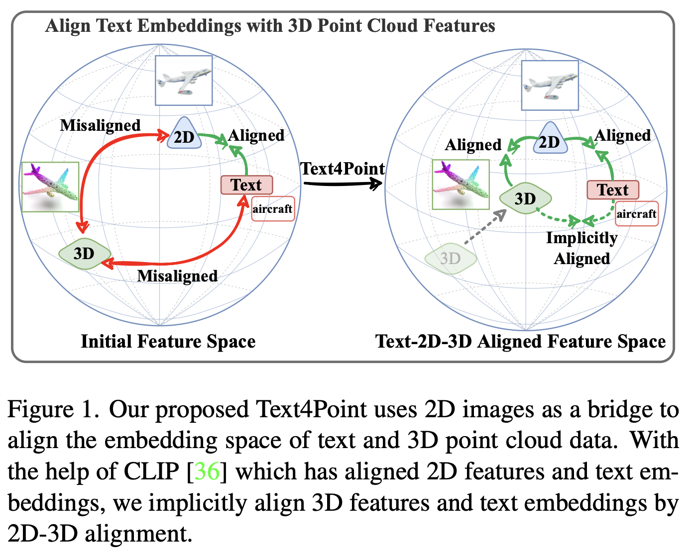
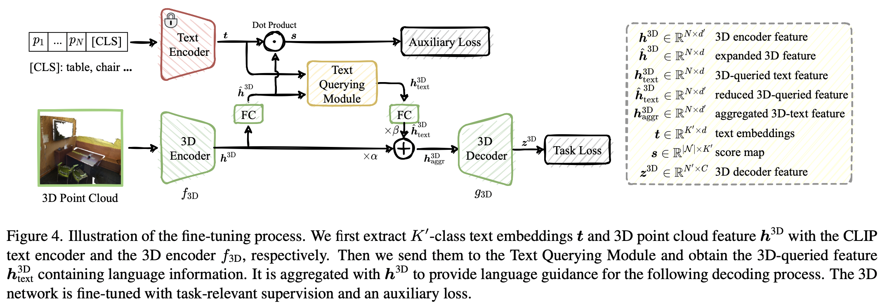

# Text4Point

This repository will be the official Pytorch implementation for Text4Point. 

## Abstract
Recent advancements in vision-language pre-training (*e.g.*, CLIP) have shown that vision models can benefit from language supervision. 
While many models using language modality have achieved great success on 2D vision tasks, the joint representation learning of 3D point cloud with text remains under-explored due to the difficulty of 3D-Text data pair acquisition and the irregularity of 3D data structure. 
In this paper, we propose a novel Text4Point framework to construct language-guided 3D point cloud models. The key idea is utilizing 2D images as a bridge to connect the point cloud and the language modalities. The proposed Text4Point follows the pre-training and fine-tuning paradigm. During the pre-training stage, we establish the correspondence of images and point clouds based on the readily available RGB-D data and use contrastive learning to align the image and point cloud representations. Together with the well-aligned image and text features achieved by CLIP, the point cloud features are implicitly aligned with the text embeddings. Further, we propose a Text Querying Module to integrate language information into 3D representation learning by querying text embeddings with point cloud features. For fine-tuning, the model learns task-specific 3D representations under informative language guidance from the label set without 2D images. Extensive experiments demonstrate that our model shows consistent improvement on various downstream tasks, such as point cloud semantic segmentation, instance segmentation, and object detection.

## Main idea

  

## Pre-train

  

## Finetune

  

## Code
Code will come soon.

## Contact
hr20 at mails dot tsinghua dot edu dot cn